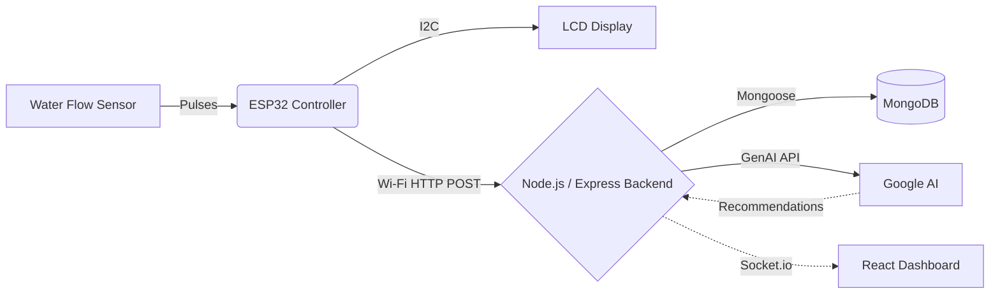

# 🚀 AquaSense

> AI-Enabled Smart Water Monitoring and Conservation System


AquaSense is an intelligent embedded system that combines **ESP32**, **IoT**, **Cloud Computing**, and **Artificial Intelligence** to monitor household water usage in real time. Instead of only measuring water consumption, AquaSense analyzes usage behavior, predicts probable household activities, detects abnormal consumption or leakage, and provides personalized water conservation recommendations.

## 📑 Table of Contents

- [Overview](#-overview)
- [Key Features](#-key-features)
- [Tech Stack](#-tech-stack)
- [System Architecture](#-system-architecture)
- [Project Structure](#-project-structure)
- [Prerequisites](#-prerequisites)
- [Installation](#-installation)
- [Environment Configuration](#-environment-configuration)
- [Running the Project](#-running-the-project)
- [How It Works](#-how-it-works)
- [API Documentation](#-api-documentation)
- [Database Usage](#-database-usage)
- [Future Improvements](#-future-improvements)
- [Authors](#-authors)

## 📖 Overview

Water is a limited natural resource, and efficient water management is becoming increasingly important. Traditional water meters only display the total amount of water consumed and do not provide insights into *how*, *when*, or *why* water is being used.

AquaSense provides an intelligent solution by continuously monitoring water flow rates, consumption, and duration. Collected data is uploaded to a cloud database where a Machine Learning model (via Google GenAI) analyzes usage patterns to provide real-time feedback, leak detection, and smart water-saving recommendations.

## ✨ Key Features

- **Real-Time Monitoring:** Tracks flow rate (L/min), session volume, and total water usage instantly.
- **AI-Powered Analysis:** Predicts household activities (e.g., bathing, washing) using Google Gemini AI.
- **Intelligent Leak Detection:** Identifies abnormal consumption patterns and potential leaks.
- **Personalized Recommendations:** Generates AI-driven conservation tips based on actual usage.
- **Hardware Integration:** Embedded ESP32 logic with RTC (Real-Time Clock) and an LCD display for on-device status.
- **Live Dashboard:** React-based frontend dashboard with live data updates via WebSockets (Socket.io).

## 🛠 Tech Stack

| Category | Technology |
| --- | --- |
| **Hardware / IoT** | ESP32, C++ (Arduino), YF-S201 Flow Sensor, DS3231 RTC, ST7032 LCD |
| **Frontend** | React 18, Vite, Tailwind CSS, Framer Motion, Recharts, Socket.io-client |
| **Backend** | Node.js, Express.js, Socket.io |
| **Database** | MongoDB (Mongoose) |
| **AI Integration** | Google GenAI API (`@google/genai` and `@google/generative-ai`) |

## 📐 System Architecture



**Workflow:**
1. **Sensing:** The YF-S201 sensor generates pulses based on water flow.
2. **Processing:** The ESP32 calculates flow rate, total volume, and session duration.
3. **Transmission:** The ESP32 sends a JSON payload to the backend API over Wi-Fi.
4. **Storage & AI:** The backend stores data in MongoDB and requests analysis from Google AI.
5. **Visualization:** The React dashboard receives real-time updates via WebSockets and displays metrics, charts, and AI insights.

## 📂 Project Structure

```text
AquaSense/
├── backend/                  # Node.js Express server
│   ├── config/               # Database and server config
│   ├── controllers/          # API route handlers (AI, Water)
│   ├── models/               # MongoDB schemas
│   ├── routes/               # Express API routes
│   ├── server.js             # Main backend entry point
│   └── package.json
├── dashboard/                # React frontend (Vite)
│   ├── src/
│   │   ├── components/       # Reusable UI components
│   │   ├── services/         # API integration logic
│   │   └── App.jsx
│   ├── tailwind.config.js    # Tailwind styling config
│   └── package.json
├── Wokwi_Simulation/         # Simulation files for the ESP32 hardware
├── Hardwar_Code.py           # ESP32 C++ implementation
├── aquasense_enclosure.py    # Hardware enclosure scripts/models
└── AquaSense_Project_Documentation.md # Original project documentation
```

| File / Directory | Purpose |
| --- | --- |
| `backend/` | Handles APIs, Database logic, Socket.io, and AI processing |
| `dashboard/` | Provides the web user interface to monitor metrics |
| `Hardwar_Code.py` | C++ source code for the ESP32 microcontroller |

## 📋 Prerequisites

Before starting, ensure you have the following installed:

- [Node.js](https://nodejs.org/) (v18+ recommended)
- [MongoDB](https://www.mongodb.com/) (Local instance or Atlas URI)
- [Git](https://git-scm.com/)
- Arduino IDE (if flashing to a physical ESP32)
- Google Gemini API Key (for AI features)

## 🚀 Installation

1. **Clone the repository:**
   ```bash
   git clone <your-repository-url>
   cd EPProject
   ```

2. **Setup the Backend:**
   ```bash
   cd backend
   npm install
   ```

3. **Setup the Dashboard (Frontend):**
   ```bash
   cd ../dashboard
   npm install
   ```

## ⚙️ Environment Configuration

You need to configure environment variables for both the backend and the frontend. 

**Backend (`backend/.env`):**
Create a `.env` file in the `backend/` directory:
```env
PORT=5000
MONGO_URI=mongodb://localhost:27017/aquasense
FRONTEND_URL=http://localhost:5173
GEMINI_API_KEY=your_gemini_api_key_here
```

**Frontend (`dashboard/.env`):**
Create a `.env` file in the `dashboard/` directory:
```env
VITE_GEMINI_API_KEY=your_gemini_api_key_here
```

| Variable | Description | Required |
| --- | --- | --- |
| `MONGO_URI` | MongoDB connection string | Yes |
| `GEMINI_API_KEY` / `VITE_GEMINI_API_KEY` | Key for Google AI analysis | Yes |
| `FRONTEND_URL` | Used for CORS in the backend | Yes |

## 💻 Running the Project

### Start the Backend Server

```bash
cd backend
npx nodemon server.js
# Or standard run: node server.js
```
The backend will run on `http://localhost:5000`.

### Start the React Dashboard

```bash
cd dashboard
npm run dev
```
The frontend will be available at `http://localhost:5173`.

### Hardware Deployment
Open `Hardwar_Code.py` (which contains C++ code) in the Arduino IDE, update the `WIFI_SSID`, `WIFI_PASSWORD`, and `SERVER_URL` constants, and flash it to your ESP32 board.

## 🔌 API Documentation

### Water Data Endpoints
Base URL: `/api/water`

| Method | Endpoint | Description |
| --- | --- | --- |
| `POST` | `/` | Add a new sensor reading from ESP32 |
| `GET` | `/latest` | Fetch the most recent water reading |
| `GET` | `/history` | Fetch historical water consumption data |
| `GET` | `/today` | Fetch total consumption for the current day |
| `GET` | `/stats` | Get aggregated statistical data |
| `GET` | `/charts/hourly` | Get hourly breakdown for charts |
| `DELETE`| `/clear` | Delete all water readings |

**Example `POST /api/water` Body:**
```json
{
  "deviceId": "AquaSense001",
  "deviceName": "Main Water Meter",
  "date": "24-08-2026",
  "time": "10:45:00",
  "flowRate": 12.5,
  "pulseCount": 94,
  "sessionWater": 5.2,
  "totalWater": 150.4,
  "status": "FLOWING"
}
```

### AI Chat Endpoint
Base URL: `/api/ai`

| Method | Endpoint | Description |
| --- | --- | --- |
| `POST` | `/chat` | Chat with the AI regarding water usage and tips |

## 🗄 Database Usage

**Technology:** MongoDB via Mongoose ORM.
**Main Collection:** `WaterReading`
The database stores individual telemetry logs from the ESP32. Real-time monitoring pushes this data both into the database and out through Socket.io for immediate UI reflection. 

## 🔮 Future Improvements

### Planned Improvements
- Integration with mobile applications.
- Automatic water shutoff via smart valve control in case of severe leakage.

### Possible Improvements
- Voice assistant integration (Alexa / Google Home).
- Multi-house monitoring for community-level insights.
- Predictive maintenance for pipe systems.

## 👥 Authors

**Developed by:**
- Srijith R
- Naveen Prasath M

**Supervisors:**
- Mrs. Sabareeswari
- Ms. Pavithrarao

---
*Created as an Embedded Programming Project.*
